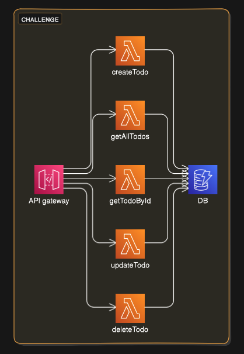
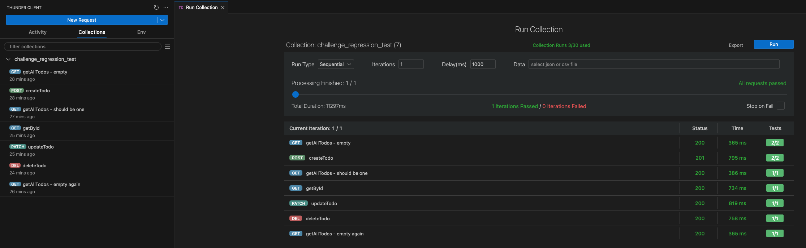

# challenge-todo-app

## Requirements

Build a Serverless Framework REST API with AWS API Gateway which supports CRUD functionality (Create, Read, Update, Delete) don't use service proxy integration directly to DynamoDB from API Gateway

Please use GitHub Actions CI/CD pipeline, AWS CodePipeline, or Serverless Pro CI/CD to handle deployments.

You can take screenshots of the CI/CD setup and include them in the README.

The CI/CD should trigger a deployment based on a git push to the master branch which goes through and deploys the backend Serverless Framework REST API and any other resources e.g. DynamoDB Table(s).
Requirements

1.  All application code must be written using NodeJS, Typescript is acceptable as well

2.  All AWS Infrastructure needs to be automated with IAC using Serverless Framework

3.  The API Gateway REST API should store data in DynamoDB

4.  There should be 4-5 lambdas that include the following CRUD functionality (Create, Read, Update, Delete) \*don't use service proxy integration directly to DynamoDB from API Gateway

5.  Build the CI/CD pipeline to support multi-stage deployments e.g. dev, prod

6.  The template should be fully working and documented

7.  A public GitHub repository must be shared with frequent commits

8.  A video should be recorded (www.loom.com) of you talking over the application code, IAC, and any additional areas you want to highlight in your solution to demonstrate additional skills

Please spend only what you consider a reasonable amount of time for this.

### Optionally

Please feel free to include any of the following to show additional experience:

- Make the project fit a specific business case e.g. Coffee Shop APIs vs Notes CRUD directly from AWS docs
- AWS Lambda packaging
- Organization of YAML files
- Bash/other scripts to support deployment
- Unit tests, integration tests, etc

## GitHub repository

https://github.com/msvallarino/challenge

## Architecture



## Solution

The current solution was developed using Serverless Framework with YAML syntax, used GitHub Actions to deploy to AWS. The CRUD API is a simple TODO app, using Typescript, with the following endpoints:

- GET - https://yrl9sij6o4.execute-api.us-east-1.amazonaws.com/v1/specs (you can see the Swagger OpenAPI specs here)
- GET - https://yrl9sij6o4.execute-api.us-east-1.amazonaws.com/v1/todos/{todoId}
- GET - https://yrl9sij6o4.execute-api.us-east-1.amazonaws.com/v1/todos
- POST - https://yrl9sij6o4.execute-api.us-east-1.amazonaws.com/v1/todos
- PATCH - https://yrl9sij6o4.execute-api.us-east-1.amazonaws.com/v1/todos/{todoId}
- DELETE - https://yrl9sij6o4.execute-api.us-east-1.amazonaws.com/v1/todos/{todoId}

Having deployed the following AWS functions:

- specs: todo-app-prod-specs (39 kB)
- getTodo: todo-app-prod-getTodo (2.9 MB)
- getTodosList: todo-app-prod-getTodosList (2.9 MB)
- createTodo: todo-app-prod-createTodo (2.9 MB)
- updateTodo: todo-app-prod-updateTodo (2.9 MB)
- removeTodo: todo-app-prod-removeTodo (2.9 MB)

The packaging of Typescript code going in the AWS Lambda was done using the Serverless Framework plugin called `serverless-esbuild`.

For securing the API I used `middy` library and a fixed `x-api-key` Header required for each call, otherwise you will be receiving:

```json
{
	"statusCode": 401,
	"payload": {
		"statusCode": 401,
		"error": "Unauthorized",
		"message": "Unauthorized Access, incorrect or missing auth header \"x-api-key\""
	},
	"headers": {}
}
```

The AWS Lambdas handlers are located in `src > api` folder where the folder structure represents the URL with their PATH parameters for each endpoint.

The "Business Logic/Rules" are located in the TODO Service (`src > services`), right now are pretty simple or inexistent, but they are meant to be place here.

The "Database Layer" is located in the TODO Repository (`src > repositories`), where if for any reason there is a need to change the DB solution its only required to change the `repository.ts` file, always respecting the `interface.ts` that is the "contract" between the DB Layer and its consumers (the TODO Service).

The `schemas` folder holds the endpoints (POST and PATCH) body validators and types, for this I used `Zod` validations library.

The `model` folder holds the TODO model definition, validators and types, for this I used `Zod` validations library.

## CI/CD

As mentioned above the CI/CD is done via GitHub Actions as you can see here https://github.com/msvallarino/challenge/actions, right now its consist of 2 workflows, one for PROD and one for DEV, that triggers depending on which branch is updated, this solution is very minimal, ideally this should be align with the team release strategy, depending if we use long live branches, tags, requirements, etc.

## Integration Test

The very minimal regression test was done using Thunder Client, the environment and collection could be found in the folder `integration_test`.



## Future Improvements

- Add Unit test, I didnt have time, but you can notice that Im injecting all dependencies to the Handler (it could be improved with some interfaces/types), so mocking the Services, Repositories and Logger is pretty straightforward.
- Improve authentication solution, not only used a robust solution but also the Auth Key is set as an environment variable, which works but its not ideal, the use of AWS Secret Manager or Parameter Store is preferred.
- The ESLint and Prettier configuration may have some conflicts/place of improvements.
- The validation of user inputs could be improved with its own validator service, so the use of it in the handlers is not attached to the Zod library.
- The YAML file of Serverless Framework could be split in several files, also it could be done using Typescript syntax too, which not only allow having multiple files but also enables the unit test of the infrastructure.
- Add a custom domain name with AWS CloudFront.
- Make the POST and DELETE endpoints idempotent.
- Remove hardcoded values like `servers` in the OpenAPI specs.
